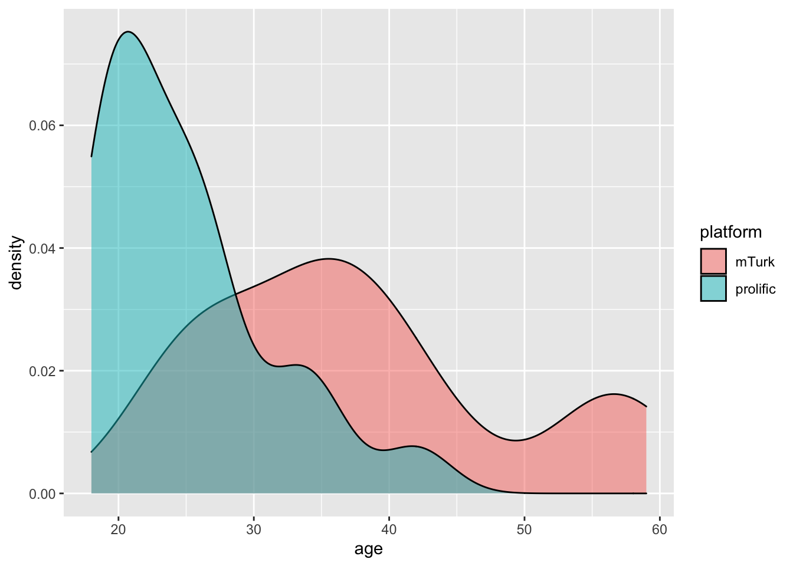
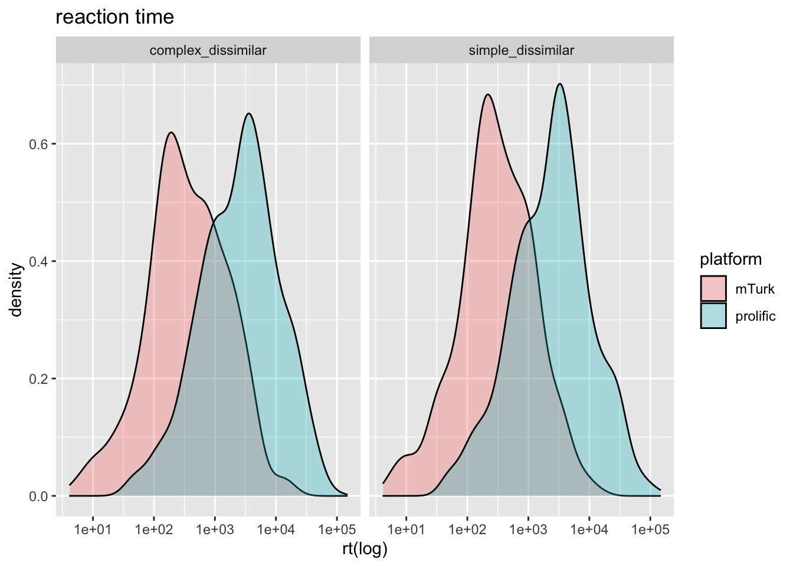
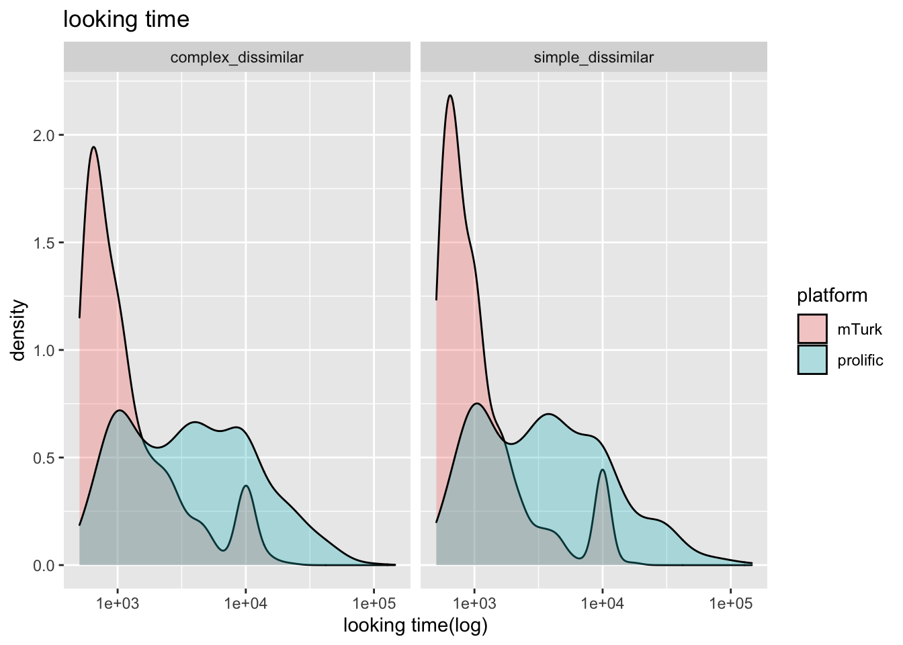
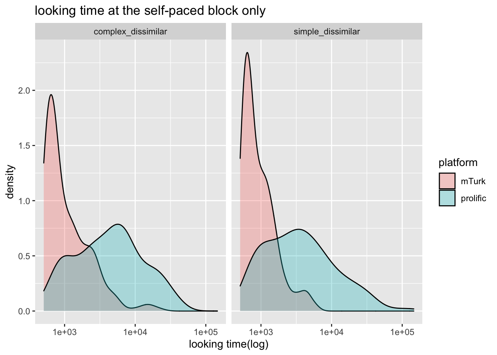
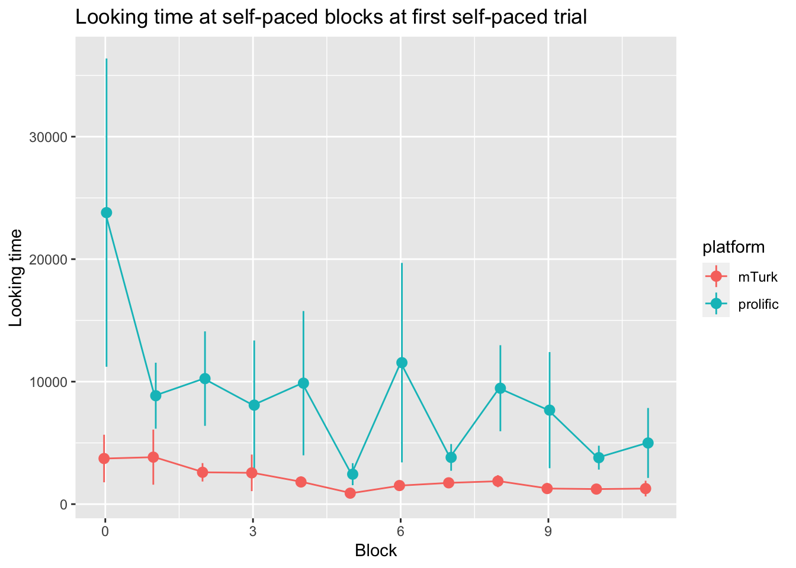
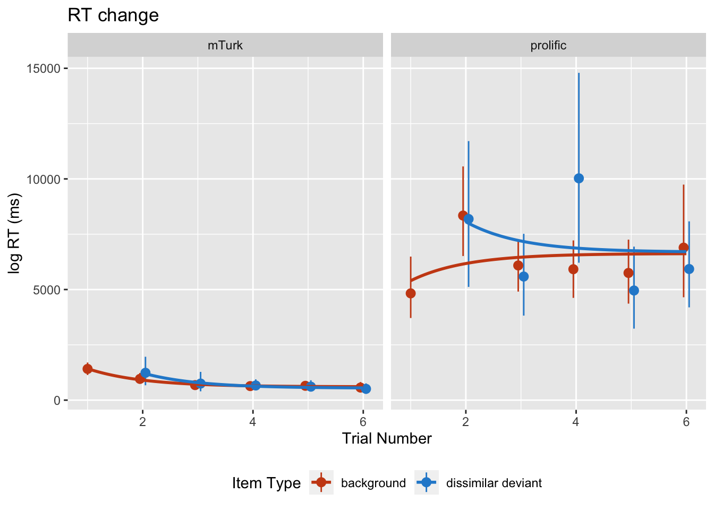
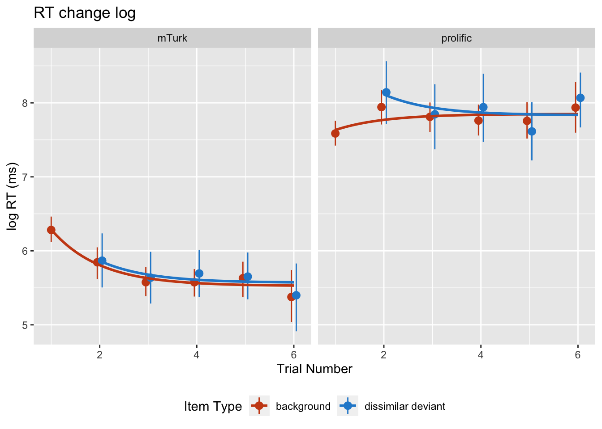
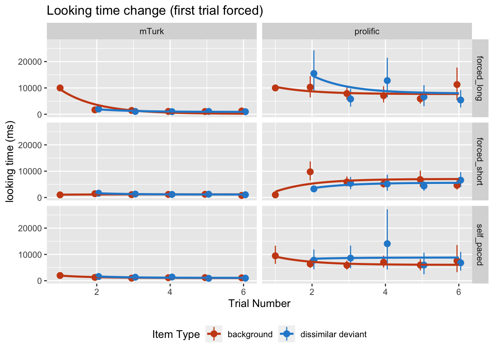
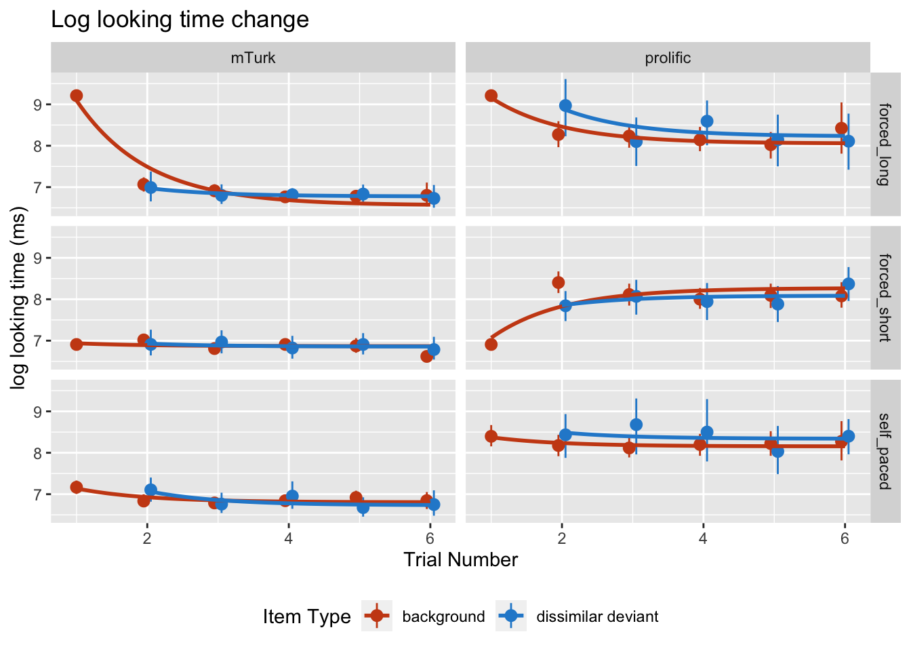
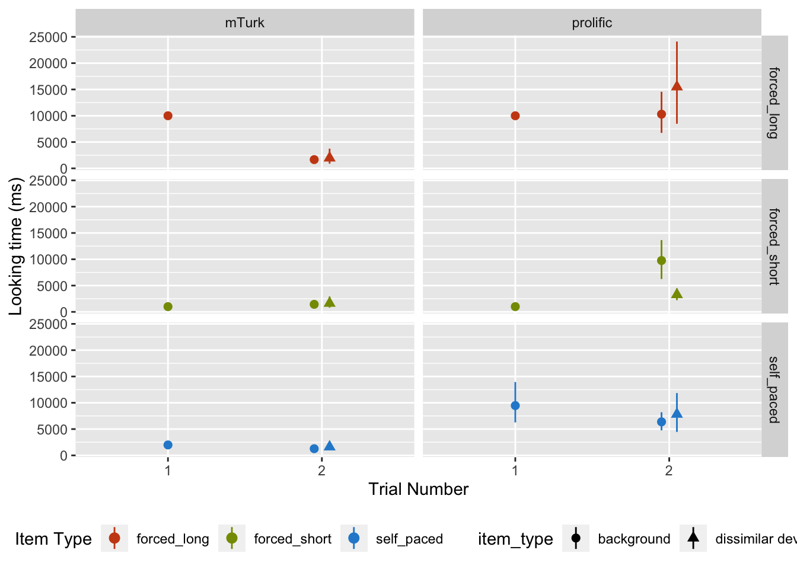

```r
library(tidyverse)
```

```
## ── Attaching packages ─────────────────────────────────────── tidyverse 1.3.0 ──
```

```
## ✓ ggplot2 3.3.3     ✓ purrr   0.3.4
## ✓ tibble  3.1.0     ✓ dplyr   1.0.5
## ✓ tidyr   1.1.1     ✓ stringr 1.4.0
## ✓ readr   1.3.1     ✓ forcats 0.4.0
```

```
## ── Conflicts ────────────────────────────────────────── tidyverse_conflicts() ──
## x dplyr::filter() masks stats::filter()
## x dplyr::lag()    masks stats::lag()
```

```r
library(here)
```

```
## here() starts at /Users/caoanjie/Desktop/projects/looking_time/adult_analysis
```

```r
m_rt <- read_csv(here("data/platform_comparison_data/mTurk/processed_data/trimmed_RTdata.csv")) %>% mutate(platform = "mTurk")
```

```
## Parsed with column specification:
## cols(
##   subject = col_character(),
##   block_number = col_double(),
##   block_type = col_character(),
##   trial_number = col_double(),
##   item_type = col_character(),
##   trial_type = col_character(),
##   trial_complexity = col_character(),
##   item_id = col_character(),
##   rt = col_double(),
##   exposure_type = col_character(),
##   half = col_character(),
##   block_deviant_number = col_double(),
##   trial_type_index = col_character(),
##   first_dev_position = col_double(),
##   second_dev_position = col_double()
## )
```

```r
m_demog <- read_csv(here("data/platform_comparison_data/mTurk/processed_data/trimmed_demogdata.csv")) %>% mutate(platform = "mTurk")
```

```
## Parsed with column specification:
## cols(
##   subject = col_character(),
##   age = col_double(),
##   ethnicity = col_character(),
##   gender = col_character(),
##   education = col_character()
## )
```

```r
m_complexity <- read_csv(here("data/platform_comparison_data/mTurk/processed_data/trimmed_complexitydata.csv")) %>% mutate(platform = "mTurk")
```

```
## Parsed with column specification:
## cols(
##   subject = col_character(),
##   question_type = col_character(),
##   stimulus = col_character(),
##   rating = col_double()
## )
```

```r
m_similarity <- read_csv(here("data/platform_comparison_data/mTurk/processed_data/trimmed_similaritydata.csv")) %>% mutate(platform = "mTurk")
```

```
## Parsed with column specification:
## cols(
##   subject = col_character(),
##   question_type = col_character(),
##   stimulus_left = col_character(),
##   stimulus_right = col_character(),
##   rating = col_double()
## )
```

```r
p_rt <- read_csv(here("data/platform_comparison_data/prolific/processed_data/trimmed_RTdata.csv")) %>% mutate(platform = "prolific")
```

```
## Parsed with column specification:
## cols(
##   subject = col_character(),
##   block_number = col_double(),
##   block_type = col_character(),
##   trial_number = col_double(),
##   item_type = col_character(),
##   trial_type = col_character(),
##   trial_complexity = col_character(),
##   item_id = col_character(),
##   rt = col_double(),
##   exposure_type = col_character(),
##   half = col_character(),
##   block_deviant_number = col_double(),
##   trial_type_index = col_character(),
##   first_dev_position = col_double(),
##   second_dev_position = col_double()
## )
```

```r
p_demog <- read_csv(here("data/platform_comparison_data/prolific/processed_data/trimmed_demogdata.csv")) %>% mutate(platform = "prolific")
```

```
## Parsed with column specification:
## cols(
##   subject = col_character(),
##   age = col_double(),
##   ethnicity = col_character(),
##   gender = col_character(),
##   education = col_character()
## )
```

```r
p_complexity <- read_csv(here("data/platform_comparison_data/prolific/processed_data/trimmed_complexitydata.csv")) %>% mutate(platform = "prolific")
```

```
## Parsed with column specification:
## cols(
##   subject = col_character(),
##   question_type = col_character(),
##   stimulus = col_character(),
##   rating = col_double()
## )
```

```r
p_similarity <- read_csv(here("data/platform_comparison_data/prolific/processed_data/trimmed_similaritydata.csv")) %>% mutate(platform = "prolific")
```

```
## Parsed with column specification:
## cols(
##   subject = col_character(),
##   question_type = col_character(),
##   stimulus_left = col_character(),
##   stimulus_right = col_character(),
##   rating = col_double()
## )
```


```r
rt <- bind_rows(m_rt, p_rt) %>% 
  mutate(looking_time = case_when(
    exposure_type == "forced_short" & trial_number == 1 ~ 1000, 
    exposure_type == "forced_long" & trial_number == 1 ~ 10000, 
    TRUE ~ 500 + rt
  ))
demog <- bind_rows(m_demog, p_demog)
complexity <- bind_rows(m_complexity, p_complexity)
similarity <- bind_rows(m_similarity, p_similarity)
```

# basic descriptive 

```r
rt %>% 
  group_by(platform) %>% 
  distinct(subject, .keep_all = TRUE) %>% 
  count()
```

```
## # A tibble: 2 x 2
## # Groups:   platform [2]
##   platform     n
##   <chr>    <int>
## 1 mTurk       23
## 2 prolific    21
```

```r
demog %>% 
  ggplot(aes(x = age, fill = platform)) + 
  geom_density(alpha = .5)
```




```r
rt %>% 
   ggplot(aes(x = rt, fill = platform)) + 
  geom_density(alpha = .3) + 
  scale_x_log10() + 
  facet_wrap(~block_type) + 
  xlab("rt(log)") + 
  labs(title = "reaction time" )
```



```r
rt %>% 
   ggplot(aes(x = looking_time, fill = platform)) + 
  geom_density(alpha = .3) + 
  scale_x_log10() + 
  facet_wrap(~block_type) + 
  xlab("looking time(log)") + 
  labs(title = "looking time")
```



```r
rt %>% 
  filter(exposure_type == "self_paced") %>% 
   ggplot(aes(x = looking_time, fill = platform)) + 
  geom_density(alpha = .3) + 
  scale_x_log10() + 
  facet_wrap(~block_type) + 
  xlab("looking time(log)") + 
  labs(title = "looking time at the self-paced block only")
```




```r
rt %>% 
  filter(exposure_type == "self_paced") %>% 
  filter(trial_number == 1) %>% 
  ggplot(aes(x = block_number, 
             y = looking_time, 
             color = platform)) + 
  stat_summary(position = position_dodge(width = 0.1))  + 
  stat_summary(geom = "line") + 
  xlab("Block") + 
  ylab("Looking time") + 
  labs(title = "Looking time at self-paced blocks at first self-paced trial")
```

```
## No summary function supplied, defaulting to `mean_se()`
## No summary function supplied, defaulting to `mean_se()`
```



```r
  #facet_wrap(~exposure_type)
```


```r
ggplot(rt, 
       aes(x=trial_number, y=rt, colour=item_type)) + 
  stat_summary(fun.data = "mean_cl_boot", position = position_dodge(width = .2)) + 
  geom_smooth(method = "lm", 
              formula = y ~ I(exp(1)**(-x)), se = FALSE) + 
  facet_wrap(~platform) +
  langcog::scale_color_solarized(name = "Item Type") + 
  theme(legend.position = "bottom") + 
  ylab("log RT (ms)") + 
  xlab("Trial Number") + 
  labs(title = "RT change")
```



```r
ggplot(rt, 
       aes(x=trial_number, y=log(rt), colour=item_type)) + 
  stat_summary(fun.data = "mean_cl_boot", position = position_dodge(width = .2)) + 
  geom_smooth(method = "lm", 
              formula = y ~ I(exp(1)**(-x)), se = FALSE) + 
  facet_wrap(~platform) +
  langcog::scale_color_solarized(name = "Item Type") + 
  theme(legend.position = "bottom") + 
  ylab("log RT (ms)") + 
  xlab("Trial Number") + 
  labs(title = "RT change log")
```




```r
ggplot(rt, 
       aes(x=trial_number, y=looking_time, colour=item_type)) + 
  stat_summary(fun.data = "mean_cl_boot", position = position_dodge(width = .2)) + 
  geom_smooth(method = "lm", 
              formula = y ~ I(exp(1)**(-x)), se = FALSE) + 
  #facet_wrap(~platform) +
  facet_grid(exposure_type ~ platform) + 
  langcog::scale_color_solarized(name = "Item Type") + 
  theme(legend.position = "bottom") + 
  ylab("looking time (ms)") + 
  xlab("Trial Number") + 
  labs(title = "Looking time change (first trial forced)")
```



```r
ggplot(rt, 
       aes(x=trial_number, y=log(looking_time), colour=item_type)) + 
  stat_summary(fun.data = "mean_cl_boot", position = position_dodge(width = .2)) + 
  geom_smooth(method = "lm", 
              formula = y ~ I(exp(1)**(-x)), se = FALSE) + 
  #facet_wrap(~platform) +
  facet_grid(exposure_type ~ platform) + 
  langcog::scale_color_solarized(name = "Item Type") + 
  theme(legend.position = "bottom") + 
  ylab("log looking time (ms)") + 
  xlab("Trial Number") + 
  labs(title = "Log looking time change")
```



Zoom in on the first trial and the second trial 

```r
ggplot(rt %>% filter(trial_number %in% c(1,2)), 
       aes(x=as.factor(trial_number), y=looking_time, colour=exposure_type, shape = item_type)) + 
  stat_summary(fun.data = "mean_cl_boot", position = position_dodge(width = .2)) + 
  facet_grid(exposure_type~platform)+
  langcog::scale_color_solarized(name = "Item Type") + 
  theme(legend.position = "bottom") + 
  ylab("Looking time (ms)") + 
  xlab("Trial Number") 
```



across block? 

```r
ggplot(rt %>% mutate(block_number = block_number + 1),
       aes(x=as.factor(block_number), y=looking_time, colour=trial_complexity)) + 
  stat_summary(fun.data = "mean_cl_boot", position = position_dodge(width = .2)) + 
  geom_smooth(method = "lm", 
              formula = y ~ I(exp(1)**(-x)), se = FALSE) +
  facet_grid(~platform)+
  langcog::scale_color_solarized(name = "Trial Complexity") + 
  theme(legend.position = "bottom") + 
  ylab("Looking time (ms)") + 
  xlab("Block Number") 
```


